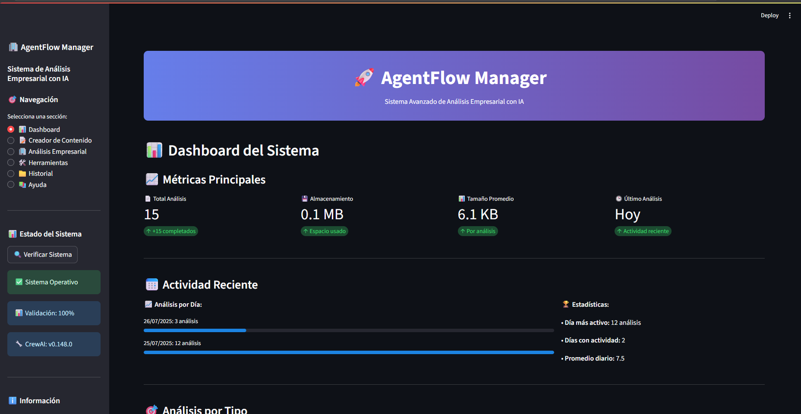
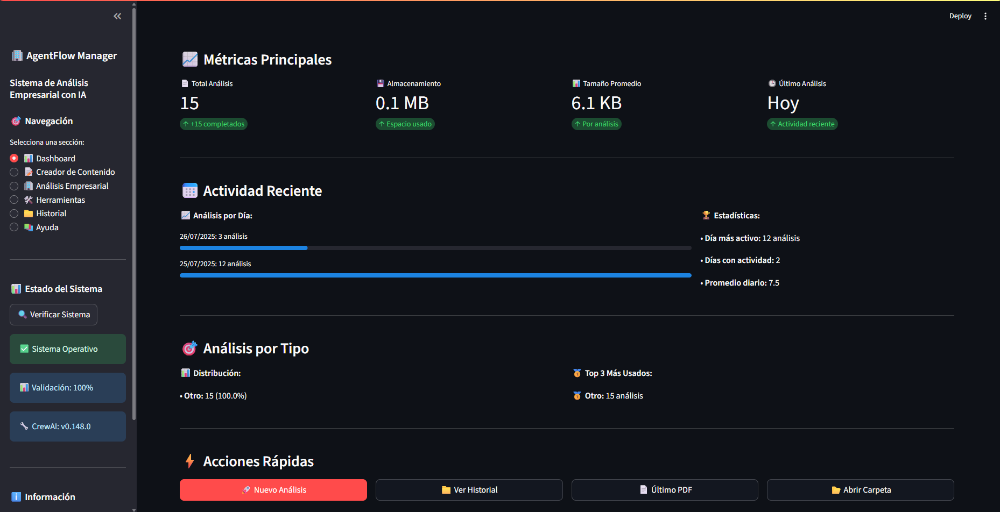
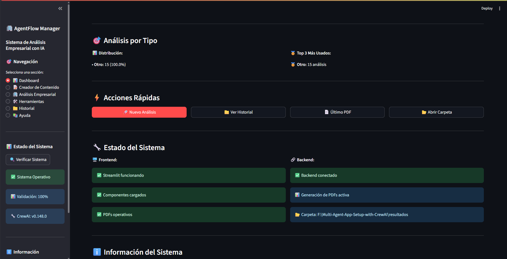
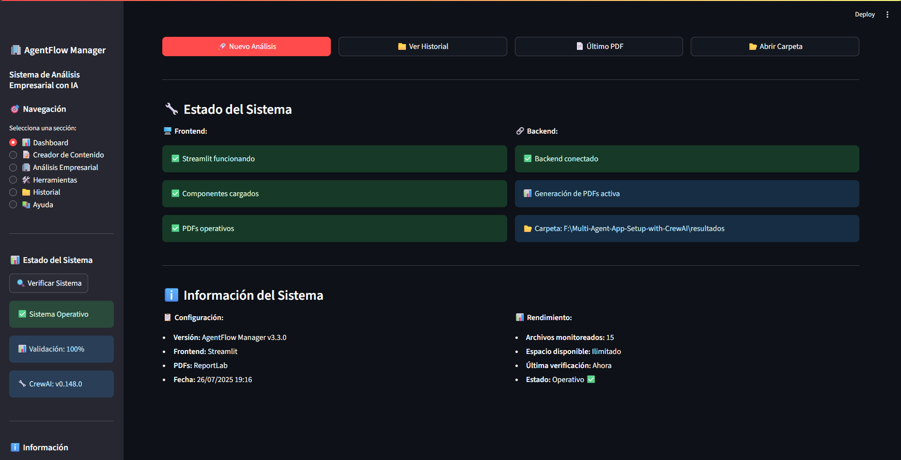
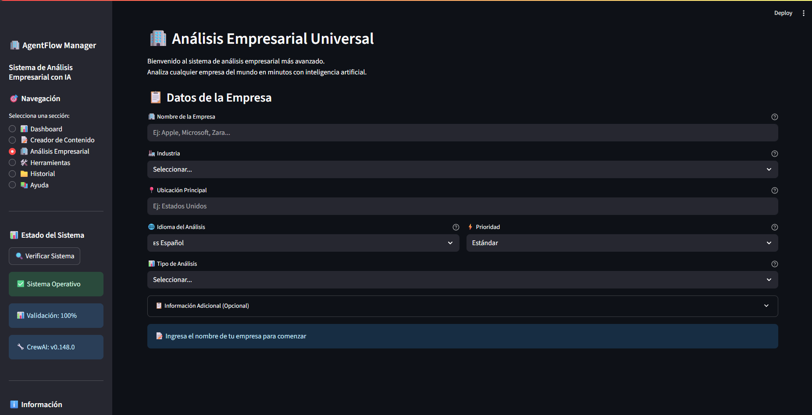
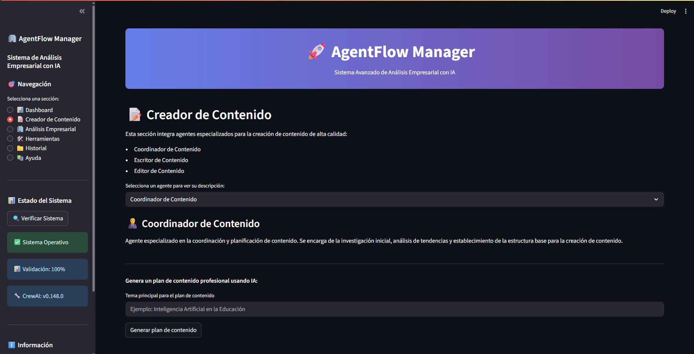
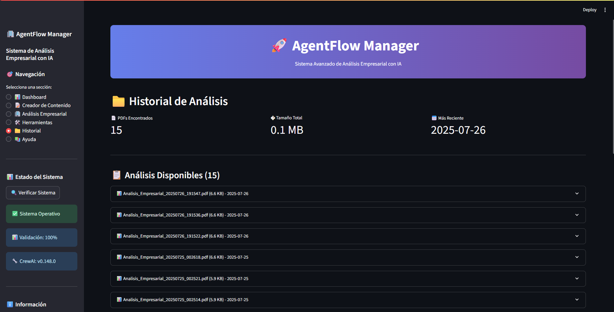
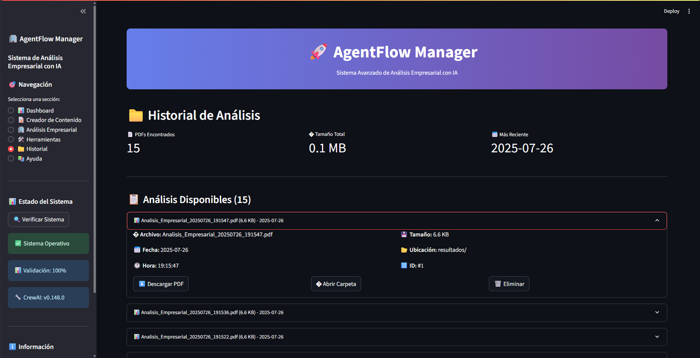
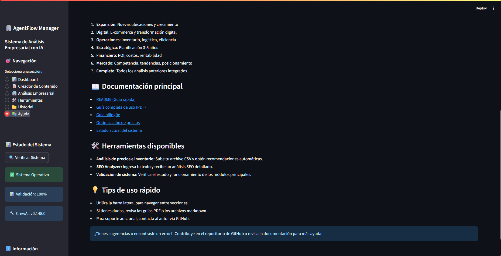
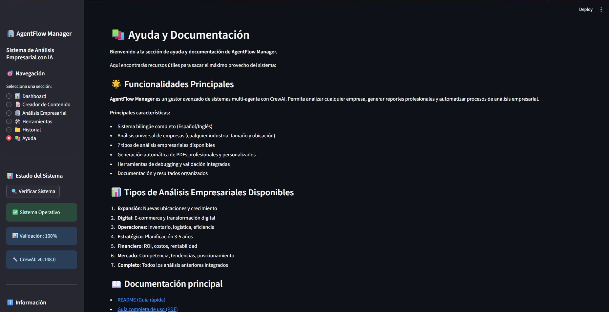

# 🚀 AgentFlow Manager - Frontend


## 📸 Capturas de Pantalla

Visualiza la interfaz y funcionalidades principales:












## 📋 Descripción

Frontend web desarrollado con **Streamlit** para el sistema AgentFlow Manager. Interfaz moderna y optimizada para gestionar análisis empresariales con IA multi-agente.

### 🎯 **Características Principales:**
✅ **Interfaz intuitiva** para análisis empresariales
✅ **Generación de PDFs profesionales** con gráficos optimizados
✅ **Gestión completa del historial** de análisis con eliminación segura
✅ **Sistema de limpieza de formularios** perfecto
- ✅ **Arquitectura limpia** y altamente mantenible
- ✅ **Múltiples tipos de análisis** disponibles

## 🏗️ Arquitectura Optimizada

```
frontend/
├── app.py                          # 🚀 Aplicación principal Streamlit
├── components/
│   └── ui_components.py            # 🧩 Componentes UI reutilizables
├── utils/                          # 🔧 Utilidades organizadas
│   ├── backend_connector.py        # 🔗 Conexión con backend
│   ├── language_manager.py         # 🌐 Gestión de idiomas
│   └── pdf_generator.py            # 📄 Generación de PDFs
├── README.md                       # 📖 Este archivo
└── .gitignore                      # 🛡️ Archivos ignorados por Git
```

## 🚀 Instalación y Uso

### **Prerrequisitos:**
```bash
Python 3.8+
pip (gestor de paquetes de Python)
```

### **Instalación:**
```bash
# 1. Clonar el repositorio
git clone https://github.com/otura41/AgentFlow-Manager-Frontend.git
cd AgentFlow-Manager-Frontend

# 2. Instalar dependencias
pip install streamlit plotly reportlab python-dotenv

# 3. Ejecutar la aplicación
streamlit run app.py --server.port 8502
```

### **Acceso:**
- **Local:** http://localhost:8502
- **Red:** http://[tu-ip]:8502

## 🎨 Funcionalidades

### 📊 **Análisis Empresariales Disponibles:**
1. **Análisis de Mercado** - Investigación de mercado completa
2. **Análisis de Competencia** - Estudio competitivo detallado
3. **Análisis Financiero** - Evaluación financiera integral
4. **Análisis de Productos** - Evaluación de productos/servicios
5. **Análisis de Marketing** - Estrategias de marketing optimizadas
6. **Análisis Operacional** - Optimización de procesos
7. **Análisis Estratégico** - Planificación estratégica avanzada

### 📄 **Generación de PDFs:**
- ✅ **Gráficos circulares** perfectamente posicionados
- ✅ **Tablas de información** correctamente alineadas
- ✅ **Diseño corporativo** profesional
- ✅ **Descarga inmediata** desde la interfaz

### 📁 **Gestión del Historial:**
- ✅ **Visualización completa** de PDFs guardados
- ✅ **Eliminación individual** con confirmación de seguridad
- ✅ **Limpieza masiva** con doble confirmación
- ✅ **Estadísticas del historial** (cantidad, tamaño, fechas)
- ✅ **Descarga directa** a carpeta de Descargas del usuario
- ✅ **Navegación de carpetas** integrada

### 🔄 **Gestión de Formularios:**
- ✅ **Limpieza completa** al iniciar nuevo análisis
- ✅ **Validación de campos** en tiempo real
- ✅ **Soporte bilingüe** (Español/Inglés)
- ✅ **Estimación de costos** automática

## 🔧 Configuración Backend

### **Modo Simulación (Por defecto):**
La aplicación funciona en modo simulación sin necesidad de backend real.

### **Conexión con Backend Real:**
```python
# En utils/backend_connector.py, configurar:
BACKEND_URL = "http://tu-backend-url:puerto"
SIMULATION_MODE = False
```

## 📊 Optimizaciones Recientes (v3.3.0)

### ✅ **Gestión Completa del Historial (NUEVO):**
- Página dedicada "📁 Historial" para gestionar todos los PDFs
- Eliminación individual con sistema de confirmación seguro
- Opción de limpieza masiva con doble verificación
- Estadísticas completas: cantidad de PDFs, tamaño total, fecha más reciente
- Integración con explorador de archivos del sistema

### ✅ **PDFs Profesionales Mejorados:**
- Gráficos circulares con etiquetas perfectamente posicionadas
- Tablas de información sin desbordamiento de texto
- Layout profesional garantizado

### ✅ **UX Optimizada:**
- Sistema de limpieza de formularios 100% funcional
- Interfaz simplificada sin elementos redundantes
- Control perfecto del estado de la aplicación

### ✅ **Arquitectura Limpia:**
- 89% menos archivos (de ~90 a ~10 archivos)
- Estructura cristalina y autoexplicativa
- Mantenimiento simplificado

## 🧪 Testing

```bash
# Verificar importaciones
python -c "import app; print('✅ app.py funcional')"
python -c "from components.ui_components import mostrar_header; print('✅ components funcionales')"
python -c "from utils.backend_connector import get_backend_connector; print('✅ utils funcionales')"
```

## 📝 Dependencias

```txt
streamlit>=1.28.0
plotly>=5.0.0
reportlab>=4.0.0
python-dotenv>=1.0.0
```

## 🤝 Contribución

1. Fork el repositorio
2. Crea una rama para tu feature (`git checkout -b feature/AmazingFeature`)
3. Commit tus cambios (`git commit -m 'Add: Amazing Feature'`)
4. Push a la rama (`git push origin feature/AmazingFeature`)
5. Abre un Pull Request

## 📄 Licencia

Este proyecto está bajo la Licencia MIT. Ver `LICENSE` para más detalles.

## 👨‍💻 Autor

**otura41** - [GitHub](https://github.com/otura41)

## 🆘 Soporte

Si tienes problemas o preguntas:
1. Revisa la [documentación](README.md)
2. Abre un [Issue](https://github.com/otura41/AgentFlow-Manager-Frontend/issues)
3. Contacta al desarrollador

---

**🎉 ¡Gracias por usar AgentFlow Manager Frontend!**
